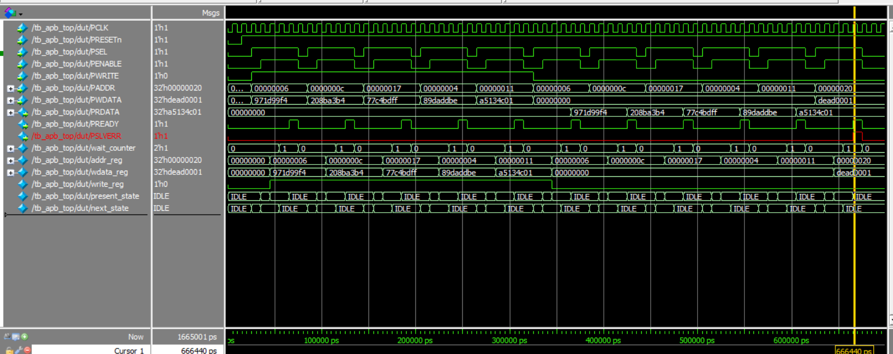

# AMBA APB Slave — SystemVerilog RTL & Verification

> A complete SystemVerilog verification project for an **AMBA APB Slave**, including synthesizable RTL, constrained-random stimulus and directed, APB master-style driving, passive monitoring, a reference-model scoreboard, error checking, and event-based test completion.

---

## 1. Project Overview

This project implements and verifies an **AMBA APB (Advanced Peripheral Bus) Slave**.

The slave supports:

- APB SETUP and ACCESS phases
- Read and write transfers
- Programmable wait states
- `PREADY` generation
- 32-entry memory
- Invalid-address detection
- `PSLVERR` generation
- `PRDATA` read responses

The verification environment follows:

```text
Generator → Driver → APB Slave DUT → Monitor → Scoreboard
```

---

# 2. AMBA APB Protocol

## 2.1 What is APB?

**APB (Advanced Peripheral Bus)** is a simple, low-power AMBA peripheral bus intended for relatively low-bandwidth devices such as GPIO, timers, UARTs, status/control registers, and small memories.

An APB transfer has two main phases:

```text
SETUP → ACCESS
```

The protocol prioritizes simplicity and predictable control over high throughput.

---

## 2.2 APB Master and Slave

An APB system contains a **Master** and one or more **Slaves**.

### APB Master

The master initiates transfers by driving:

- `PSEL`
- `PENABLE`
- `PADDR`
- `PWDATA`
- `PWRITE`

It observes:

- `PREADY`
- `PRDATA`
- `PSLVERR`

### APB Slave

The slave responds to the master's request.

For this project, the slave:

1. Detects the SETUP phase.
2. Captures address, write data, and transfer direction.
3. Enters ACCESS.
4. Counts programmable wait cycles.
5. Performs a memory read/write.
6. Asserts `PREADY` when complete.
7. Returns `PRDATA` for reads.
8. Asserts `PSLVERR` for an invalid address.

### Slave-focused view

```text
                  APB MASTER
                       |
          +------------+------------+
          |  PADDR / PWDATA        |
          |  PWRITE / PSEL         |
          |  PENABLE               |
          +------------+------------+
                       |
                       v
              +------------------+
              |    APB SLAVE     |
              |                  |
              | SETUP detection  |
              | ACCESS control   |
              | Wait counter     |
              | Memory           |
              | Error checking   |
              +--------+---------+
                       |
             +---------+---------+
             |         |         |
             v         v         v
           PRDATA    PREADY    PSLVERR
```

---

# 3. APB Transfer Phases

## 3.1 IDLE

No transfer is active:

```text
PSEL     = 0
PENABLE  = 0
```

The slave waits for a new request.

## 3.2 SETUP

The master selects the slave:

```text
PSEL     = 1
PENABLE  = 0
```

The slave captures:

```text
PADDR
PWDATA
PWRITE
```

In this design these are stored in:

```text
addr_reg
wdata_reg
write_reg
```

## 3.3 ACCESS

The master asserts:

```text
PSEL     = 1
PENABLE  = 1
```

The slave performs the requested operation.

During wait states:

```text
PREADY = 0
```

When the transfer is complete:

```text
PREADY = 1
```

For a read:

```text
PRDATA = memory[address]
```

For an invalid address:

```text
PSLVERR = 1
```

---

# 4. APB Signals

| Signal | Direction | Description |
|---|---|---|
| `PCLK` | Input | APB clock |
| `PRESETn` | Input | Active-low reset |
| `PSEL` | Input | Selects the slave |
| `PENABLE` | Input | Indicates ACCESS phase |
| `PWRITE` | Input | `1` = write, `0` = read |
| `PADDR` | Input | Transfer address |
| `PWDATA` | Input | Write data |
| `PRDATA` | Output | Read data |
| `PREADY` | Output | Transfer completion |
| `PSLVERR` | Output | Error response |

---

# 5. APB Slave FSM

The slave uses three states:

```text
                 PSEL && !PENABLE
          +----------------------------+
          |                            v
      +-------+                    +--------+
      | IDLE  |                    | SETUP  |
      +---+---+                    +----+---+
          ^                             |
          |                             | PSEL && PENABLE
          |                             v
          |                        +---------+
          +------------------------| ACCESS  |
             transfer complete     +---------+
```

### IDLE
Wait for `PSEL && !PENABLE`.

### SETUP
Capture address, data, and direction.

### ACCESS
Count wait cycles and complete the transfer when the programmed count is reached.

---

# 6. APB Slave Memory

The DUT contains:

```systemverilog
logic [DATA_WIDTH-1:0] mem [0:31];
```

Therefore valid locations are:

```text
0 through 31
```

### Write

```text
PWRITE = 1
mem[address] = PWDATA
```

### Read

```text
PWRITE = 0
PRDATA = mem[address]
```

### Invalid Address

For an address outside `0:31`:

```text
PSLVERR = 1
```

---

# 7. Wait-State Handling

The slave supports programmable wait states using:

```systemverilog
parameter N = 2
```

Conceptually:

```text
ACCESS
  |
  | wait_counter < N-1
  | PREADY = 0
  v
ACCESS
  |
  | wait_counter == N-1
  | PREADY = 1
  v
TRANSFER COMPLETE
```

This allows the testbench to verify that the master waits for `PREADY`.

---

# 8. Testbench Architecture

```text
                         +----------------+
                         |    APB TEST    |
                         +-------+--------+
                                 |
                                 v
                         +----------------+
                         |    APB ENV     |
                         +-------+--------+
                                 |
              +------------------+------------------+
              |                  |                  |
              v                  v                  v
        +-----------+      +-----------+      +-----------+
        | GENERATOR |      |  DRIVER   |      |  MONITOR  |
        +-----+-----+      +-----+-----+      +-----+-----+
              |                  |                  |
              | transaction     | APB signals     | observed
              v                  v                  | transfer
        +-----------+      +------------+           |
        | gen2drv   |----->| APB SLAVE  |-----------+
        | mailbox   |      |    DUT     |           |
        +-----------+      +------------+           |
                                                    v
                                              +-----------+
                                              | mon2scb   |
                                              | mailbox   |
                                              +-----+-----+
                                                    |
                                                    v
                                              +-----------+
                                              | SCOREBOARD |
                                              +-----------+
                                                    |
                                                    v
                                               PASS / FAIL
```

---

# 9. Verification Classes

## 9.1 `apb_if`

Groups all APB signals:

```systemverilog
interface apb_if(input logic PCLK);
    logic PRESETn;
    logic [31:0] PADDR;
    logic [31:0] PWDATA;
    logic PSEL;
    logic PENABLE;
    logic PWRITE;
    logic [31:0] PRDATA;
    logic PREADY;
    logic PSLVERR;
endinterface
```

The driver and monitor access it through a virtual interface.

---

## 9.2 `transaction`

Represents one APB operation.

Typical randomized fields:

```systemverilog
rand bit [31:0] addr;
rand bit [31:0] wdata;
rand bit        write;
```

Response fields:

```systemverilog
bit [31:0] rdata;
bit        ready;
bit        slverr;
```

Valid random addresses are constrained to:

```systemverilog
constraint addr_c {
    addr inside {[0:31]};
}
```

The transaction object separates **what should happen** from **how APB signals are driven**.

---

## 9.3 `apb_generator`

Creates stimulus.

Responsibilities:

- Create transactions
- Randomize fields
- Apply constraints
- Send transactions through `gen2drv`

Flow:

```text
new()
  ↓
randomize()
  ↓
gen2drv.put()
```

---

## 9.4 `apb_driver`

Converts transactions into APB bus activity.

Responsibilities:

- Reset the interface
- Get transactions from `gen2drv`
- Drive `PADDR`
- Drive `PWDATA`
- Drive `PWRITE`
- Drive `PSEL`
- Drive `PENABLE`
- Wait for `PREADY`

Transfer sequence:

```text
SETUP:
PSEL=1, PENABLE=0

        ↓

ACCESS:
PSEL=1, PENABLE=1

        ↓

WAIT:
while (!PREADY)

        ↓

COMPLETE
```

The driver acts as an APB master model.

---

## 9.5 `apb_monitor`

The monitor is passive.

It watches the interface and captures a completed transfer when:

```systemverilog
PSEL && PENABLE && PREADY
```

It records:

```text
PADDR
PWRITE
PWDATA
PRDATA
PREADY
PSLVERR
```

and sends the transaction to the scoreboard using `mon2scb`.

---

## 9.6 `scoreboard`

The scoreboard performs functional checking using a reference memory:

```systemverilog
bit [31:0] ref_mem [31:0];
```

### WRITE

```text
ref_mem[address] = write_data
```

### READ

```text
expected = ref_mem[address]
```

Then:

```text
expected == actual PRDATA
```

produces a **READ PASS**.

A mismatch produces a **READ FAIL**.

The scoreboard also tracks:

```text
match_cnt
mismatch_cnt
error_cnt
checked_cnt
```

### Error response

For an invalid address:

```text
PSLVERR = 1
```

The scoreboard records the error response separately.

---

## 9.7 `apb_env`

The environment integrates the verification components.

It creates and connects:

```text
Generator
Driver
Monitor
Scoreboard
Mailboxes
Virtual interface
```

Connections:

```text
Generator → gen2drv → Driver
Monitor   → mon2scb → Scoreboard
```

It is the central integration layer.

---

## 9.8 `apb_test`

Controls the overall scenario:

```text
Reset
  ↓
Start environment
  ↓
Generate transactions
  ↓
Run APB transfers
  ↓
Monitor responses
  ↓
Scoreboard checks
  ↓
Wait for test_done
  ↓
Print summary
  ↓
$finish
```

An event-based completion mechanism is used so the test ends when all expected transactions have actually been checked rather than after an arbitrary delay.

---

## 9.9 `apb_package`

Collects the class definitions:

```text
apb_transaction.sv
apb_generator.sv
apb_driver.sv
apb_monitor.sv
apb_scoreboard.sv
apb_env.sv
apb_test.sv
```

This simplifies compilation and reuse.

---

# 10. Verification Scenarios

## Scenario 1 — Write

Example:

```text
WRITE address = 5
WRITE data    = AAAA
```

Expected:

```text
PREADY  = 1
PSLVERR = 0
```

## Scenario 2 — Read

After writing:

```text
Address = 5
Data    = AAAA
```

a read should return:

```text
PRDATA = AAAA
```

and the scoreboard should report:

```text
READ PASS
```

## Scenario 3 — Multiple Writes and Reads

Example:

```text
WRITE 6  = 971D99F4
WRITE C  = 208BA3B4
WRITE 17 = 77C4BDFF
WRITE 4  = 89DADDBE
WRITE 11 = A5134C01
```

Then read those same addresses.

Expected:

```text
READ 6  → 971D99F4
READ C  → 208BA3B4
READ 17 → 77C4BDFF
READ 4  → 89DADDBE
READ 11 → A5134C01
```

## Scenario 4 — Invalid Address

Example:

```text
Address = 32
```

Since valid memory addresses are `0:31`:

```text
PREADY  = 1
PSLVERR = 1
```

The read data is not considered valid when an error response is asserted.

---

# 11. Scoreboard Report

## 📊 Final Scoreboard Output

![Scoreboard Report(assets/Scoreboard.png)


### Expected report highlights

- Valid writes accepted
- Valid reads matched reference memory
- `READ PASS` results observed
- Invalid address generated `PSLVERR`
- Completion event triggered after all expected transactions

---

# 12. Waveform

## 🌊 APB Waveform




### Signals to show

```text
PCLK
PRESETn
PSEL
PENABLE
PWRITE
PADDR
PWDATA
PRDATA
PREADY
PSLVERR
```

For a normal transfer, highlight:

```text
SETUP:
PSEL=1, PENABLE=0

ACCESS:
PSEL=1, PENABLE=1

WAIT:
PREADY=0

COMPLETE:
PREADY=1
```

For an invalid transfer:

```text
PREADY  = 1
PSLVERR = 1
```

---

# 13. Verification Flow

```text
                    TRANSACTION
                         |
                         v
                  +-------------+
                  |  GENERATOR  |
                  +------+------+
                         |
                         v
                  +-------------+
                  |   DRIVER    |
                  +------+------+
                         |
                     APB bus
                         |
                         v
                  +-------------+
                  |  APB SLAVE  |
                  |     DUT     |
                  +------+------+
                         |
                         v
                  +-------------+
                  |   MONITOR   |
                  +------+------+
                         |
                         v
                  +-------------+
                  | SCOREBOARD  |
                  +------+------+
                         |
                         v
                    PASS / FAIL
```

---

# 14. Key SystemVerilog Concepts Demonstrated

This project demonstrates:

- SystemVerilog classes
- Object-oriented verification architecture
- `rand` variables
- Constraints
- `randomize()`
- Mailboxes
- Virtual interfaces
- Driver/monitor separation
- Reference-model scoreboard
- Event-based synchronization
- Functional checking
- Error-response checking
- APB protocol phase handling
- Wait-state verification

---

# 15. Project Structure

```text
APB/
│
├── rtl/
│   └── apb_slave.sv
│
├── tb/
│   ├── apb_if.sv
│   ├── apb_transaction.sv
│   ├── apb_generator.sv
│   ├── apb_driver.sv
│   ├── apb_monitor.sv
│   ├── apb_scoreboard.sv
│   ├── apb_env.sv
│   ├── apb_test.sv
│   ├── apb_package.sv
│   └── tb_apb_top.sv
│
└── README.md
```

---

# 16. Final Summary

The APB slave combines:

```text
3-state FSM
      +
Programmable wait states
      +
32-entry memory
      +
Read / Write support
      +
Invalid-address detection
      +
PSLVERR generation
```

The verification environment combines:

```text
Constrained-random stimulus
          +
APB master-style driver
          +
Passive protocol monitor
          +
Reference-model scoreboard
          +
Error checking
          +
Event-based completion
```

The final verification flow is:

```text
Generator
    ↓
Driver
    ↓
APB Slave DUT
    ↓
Monitor
    ↓
Scoreboard
    ↓
PASS / FAIL / ERROR
```

---

## ⭐ Conclusion

This project demonstrates a complete, modular approach to verifying an APB slave using SystemVerilog.

The major separation of responsibilities is:

```text
Generator   → creates stimulus
Driver      → drives APB protocol
Monitor     → observes APB protocol
Scoreboard  → checks functionality
Environment → connects components
Test        → controls the scenario
```

This architecture provides a strong foundation for extending the project with:

- Functional coverage
- SVA protocol assertions
- More constrained-random scenarios
- Multiple APB slaves
- Register-model-based verification
- Additional protocol corner cases

---

## Author

**AMBA APB Slave RTL & SystemVerilog Verification Project**

A hands-on APB protocol and SystemVerilog verification project.
